# DNS Threat Hunting with Zeek + Splunk

I built this project to practice real DNS threat hunting — not just reading
log files someone else already collected, but capturing my own live network
traffic and hunting through it the way a SOC analyst would.

It runs on top of the [live monitoring pipeline](https://github.com/BalMM-hub/zeek-splunk-live-pipeline) I built first
(Zeek watching my network traffic, a Splunk Universal Forwarder shipping
Zeek's logs over, and Splunk Enterprise doing the analysis). In this project,
I used that pipeline to generate and investigate two attack techniques that
abuse DNS: **DNS tunneling** and **C2 beaconing**. I'll explain both below,
since they're not obvious just from the names.

---

## Objective

1. Generate three kinds of DNS traffic on purpose: normal everyday traffic,
   simulated DNS tunneling, and simulated C2 beaconing
2. Write Splunk searches that can tell the three apart
3. Turn the results into a threat-hunting dashboard
4. Document each finding the way an analyst would: what I saw → why it
   matters → what I'd do about it

---

## Why "Threat Hunting" and Not "Log Analysis"

These sound similar but aren't the same skill. Log analysis is passive —
you look at what happened after the fact. Threat hunting is proactive — you
start with a hypothesis ("if tunneling were happening, what would it look
like in my data?"), then go build a search specifically designed to prove
or disprove that hypothesis, before you know whether anything bad is
actually there. That's the approach I took here: I picked two real attack
techniques, simulated what they'd look like in DNS traffic, and then hunted
for the patterns.

---

## Lab Setup

Kali Linux VM running Zeek (captures live network traffic) and a Splunk
Universal Forwarder (ships Zeek's logs out), sending everything to Splunk
Enterprise on my host laptop over VMware's NAT network. Full architecture
details are in the [pipeline README](../README.md).

Since I'd built the pipeline the night before, I had to check everything was
still alive before starting — the forwarder restarts automatically, but Zeek
doesn't, so I had to start it fresh.

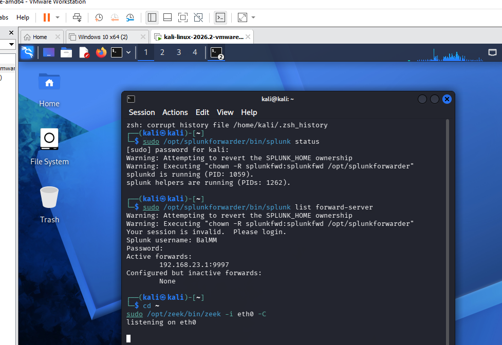
*Confirming the Splunk Universal Forwarder was running and actively
connected before restarting Zeek's live packet capture.*

---

## How I Generated the Traffic

I generated three categories of DNS queries on purpose, so I'd have a
realistic mix of normal and suspicious traffic to hunt through — a bit like
hiding a needle in a haystack I built myself.

**1. Normal baseline traffic.** Everyday lookups to real, common sites —
google.com, github.com, wikipedia.org, microsoft.com, amazonaws.com,
netflix.com. This is my "what does normal look like" reference point.

**2. Simulated DNS tunneling.** DNS tunneling is a technique where an
attacker sneaks stolen data out of a network by encoding it into DNS
queries — specifically into the subdomain part of the domain name. It works
because DNS traffic is almost never blocked by firewalls (every device needs
it just to browse the internet), so it's a good hiding spot for smuggling
data out. I simulated this by generating 20+ queries to random,
16-character hexadecimal (letters a–f and numbers 0–9) subdomains under one
made-up domain, `exfil-test-domain.com` — mimicking what encoded stolen data
would look like as a DNS query.

```bash
for i in $(seq 1 20); do
  sub=$(openssl rand -hex 8)
  nslookup ${sub}.exfil-test-domain.com
  sleep 1
done
```

**3. Simulated C2 beaconing.** "C2" stands for command-and-control — the
server an attacker uses to remotely control malware once it's on a victim's
machine. Infected machines often "beacon" — send a small check-in query —
to their C2 server on a regular timer, waiting for new instructions. I
simulated this by sending a query to a made-up domain,
`suspicious-c2-domain.net`, once every 60 seconds for 13 minutes, running
quietly in the background.

```bash
(for i in $(seq 1 15); do
  nslookup c2-beacon-sim-$i.suspicious-c2-domain.net
  sleep 60
done) &
```

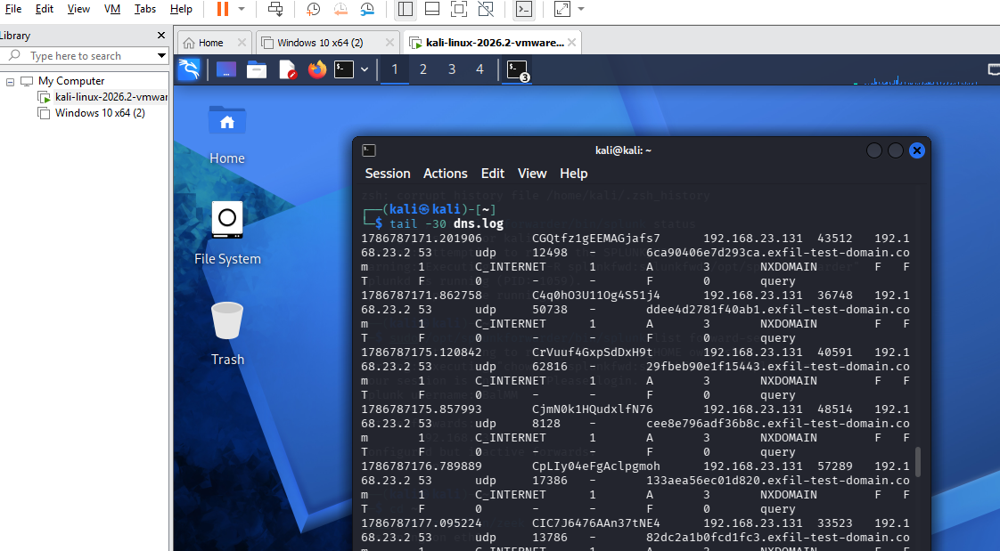
*Live `dns.log` output showing the simulated tunneling queries hitting
`exfil-test-domain.com`, each returning NXDOMAIN (meaning the domain
doesn't actually exist — expected, since I made it up), captured live by
Zeek.*

---

## A Real Problem I Ran Into: Splunk Wasn't Parsing the Data

Zeek writes its logs as TSV (tab-separated values) — basically a spreadsheet
saved as plain text, where each column is separated by a tab character
instead of a comma. To make sense of that in Splunk, I installed the
**Corelight Add-on for Zeek**, a free add-on built specifically to teach
Splunk how to split each Zeek log line into proper fields (like `query`,
`id.orig_h` for source IP, `rcode_name` for the DNS response code, etc.).

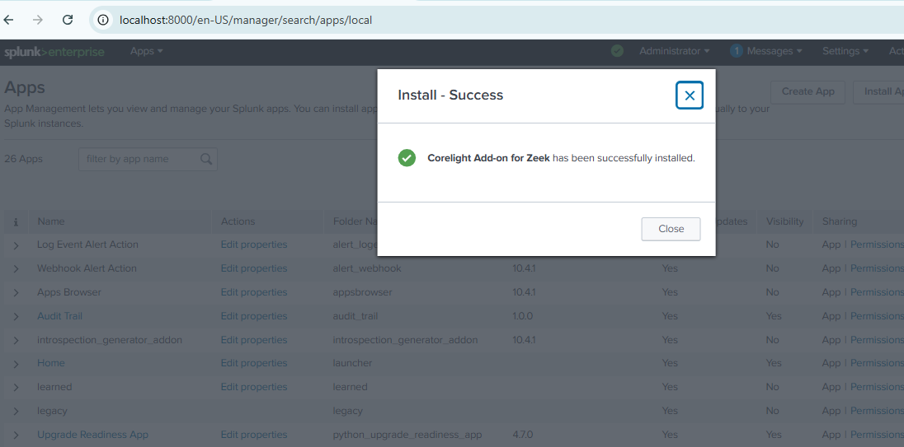
*The add-on installed and enabled inside Splunk Enterprise.*

The problem: once I actually tested it, the add-on's parser was too strict.
A chunk of my traffic — mostly background broadcast noise like mDNS/LLMNR
(protocols devices use to find each other on a local network) — had fewer
columns than Zeek's own header line said they should have. The add-on
rejected those events outright, labeling them `dns-too_small` instead of
properly parsing them. Worse, even my clean, well-formed DNS query events
came back with **zero extracted fields** — just one big blob of raw text.

**How I fixed it:** instead of continuing to fight the add-on, I wrote my
own field extraction directly in Splunk using the `rex` command. `rex` lets
you use a regex (a pattern-matching syntax) to pull specific pieces out of a
line of text and name them. Since I know Zeek separates every field with a
literal tab character, I wrote a pattern that captures each tab-separated
value and names it (source IP, destination IP, query, etc.) — no add-on
required:

```spl
| rex field=_raw "^(?<ts>[^\t]+)\t(?<uid>[^\t]+)\t(?<src_ip>[^\t]+)\t(?<src_port>[^\t]+)\t(?<dest_ip>[^\t]+)\t(?<dest_port>[^\t]+)\t(?<proto>[^\t]+)\t(?<trans_id>[^\t]+)\t(?<rtt>[^\t]+)\t(?<query>[^\t]+)\t"
```

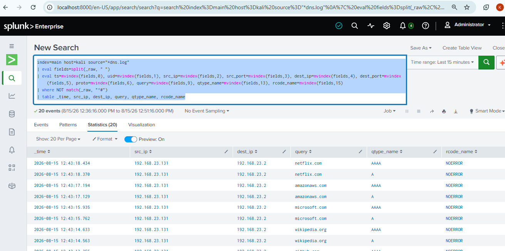
*Query, source IP, destination IP, DNS record type, and response code —
all successfully pulled out of the raw Zeek data, without relying on the
add-on at all.*

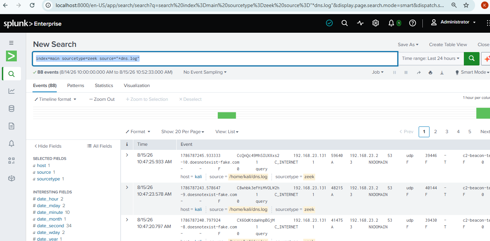
*Confirming Zeek's live DNS data was actually landing in Splunk before I
built any detection logic on top of it.*

---

## What I Found

Quick reference — how each finding maps to the [MITRE ATT&CK framework](https://attack.mitre.org/):

| Finding | Tactic | Technique |
|---|---|---|
| DNS Tunneling | Exfiltration (TA0010) | T1048.003 — Exfiltration Over Unencrypted/Obfuscated Non-C2 Protocol |
| C2 Beaconing | Command and Control (TA0011) | T1071.004 — Application Layer Protocol: DNS |

Full reasoning for each mapping is under the relevant finding below.

### Finding 1 — DNS Tunneling Indicators

**Search used:** [`splunk_searches/tunneling_detection.spl`](splunk_searches/tunneling_detection.spl)

To hunt for tunneling, I needed a way to flag subdomains that look
machine-generated instead of human-typed. Two things tend to give this
away: **length** (a human doesn't type a 16-character random subdomain) and
**digit ratio** (what percentage of the characters are numbers — real words
have very few digits, random hex strings have a lot). My search calculates
both for every subdomain, then filters for anything longer than 12
characters, since that's well beyond what normal domains use.

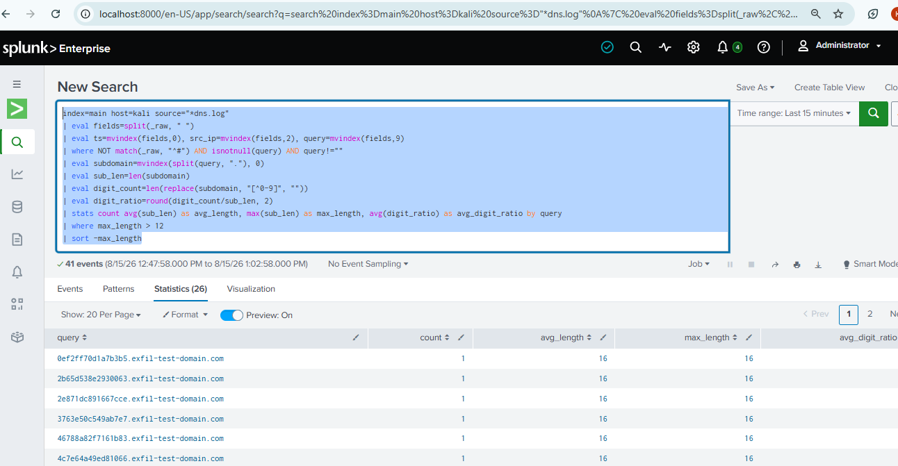
*41 matching events, with 26 distinct subdomains flagged as unusually long.*

**What I saw:** Over 40 queries went to 16-character random subdomains
under one domain, `exfil-test-domain.com`, with digit ratios between 0.44
and 0.81 (meaning up to 81% of the characters were digits). Compare that to
my baseline domains like `google.com` — a digit ratio of 0, since there
isn't a single number in it.

**Why it matters:** This length-and-randomness pattern is a real,
documented signature of DNS tunneling. Attackers use it because DNS is
rarely blocked outbound, so hiding data inside a DNS query is a reliable way
to sneak it past a firewall that's watching everything else.

**What I'd do next:** In a real environment, this pattern under a single
host would be enough to justify isolating that machine and checking it for
exfiltration tools or signs of compromise — before more data goes out.

**MITRE ATT&CK mapping:**
- **Tactic:** Exfiltration (TA0010)
- **Technique:** [T1048 — Exfiltration Over Alternative Protocol](https://attack.mitre.org/techniques/T1048/)
- **Sub-technique:** [T1048.003 — Exfiltration Over Unencrypted/Obfuscated Non-C2 Protocol](https://attack.mitre.org/techniques/T1048/003/)
- **Related:** [T1071.004 — Application Layer Protocol: DNS](https://attack.mitre.org/techniques/T1071/004/), if the same DNS channel is also being used for command-and-control rather than exfiltration alone

---

### Finding 2 — C2 Beaconing Pattern

**Search used:** [`splunk_searches/beaconing_detection.spl`](splunk_searches/beaconing_detection.spl)

For beaconing, timing is the tell. I sorted my suspicious queries by time
and calculated the gap between each one and the query right before it,
using Splunk's `streamstats` command.

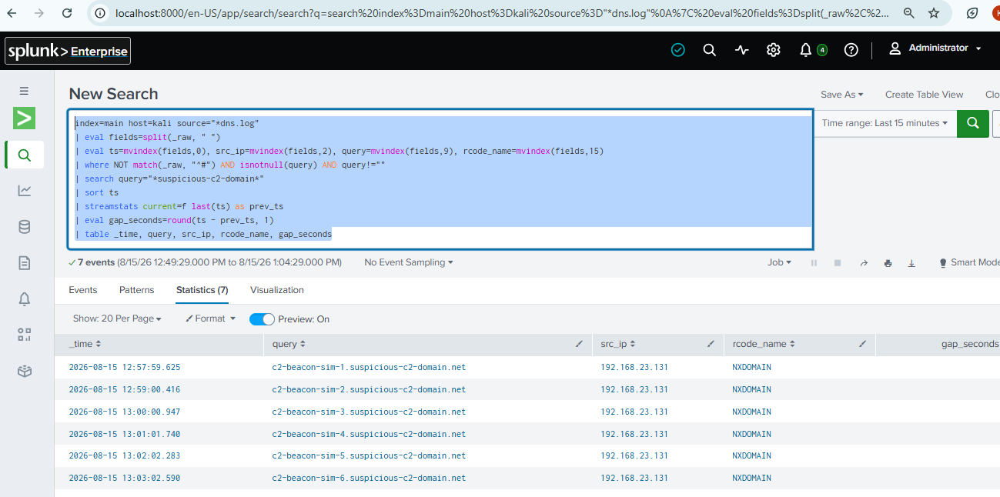
*13 queries to `suspicious-c2-domain.net`, spaced 60.3–60.9 seconds apart,
every single one coming back NXDOMAIN (the domain doesn't exist).*

**What I saw:** The queries landed almost exactly 60 seconds apart, every
time — no human browsing session naturally produces that kind of
mechanical regularity. On top of that, every single query failed to
resolve (NXDOMAIN).

**Why it matters:** Malware often "phones home" to its C2 server on a fixed
timer, checking for new instructions. A domain that fails to resolve 100%
of the time, combined with clockwork-regular timing, is a well-known
combination analysts look for — it suggests the C2 server is either
inactive, taken down, or not yet set up, but the malware is still trying.

**What I'd do next:** This combination — fixed interval, total resolution
failure — would be enough for me to flag the source host for deeper
endpoint investigation, checking for actual malware rather than assuming
it's a fluke.

**MITRE ATT&CK mapping:**
- **Tactic:** Command and Control (TA0011)
- **Technique:** [T1071.004 — Application Layer Protocol: DNS](https://attack.mitre.org/techniques/T1071/004/) (using DNS as the covert channel for C2 check-ins)
- **Related:** [T1568 — Dynamic Resolution](https://attack.mitre.org/techniques/T1568/), worth investigating further in case the beacon domains were being algorithmically generated rather than static

---

### Finding 3 — Separating Normal Traffic from the Two Attack Simulations

**Search used:** [`splunk_searches/traffic_classification.spl`](splunk_searches/traffic_classification.spl)

Finding suspicious traffic is only half the job — I also wanted to prove I
could tell it apart from everything else in the same dataset, not just
search for it in isolation. This search sorts every DNS query into one of
three buckets (Normal, Tunneling, Beaconing) using simple pattern matching
on the domain name.

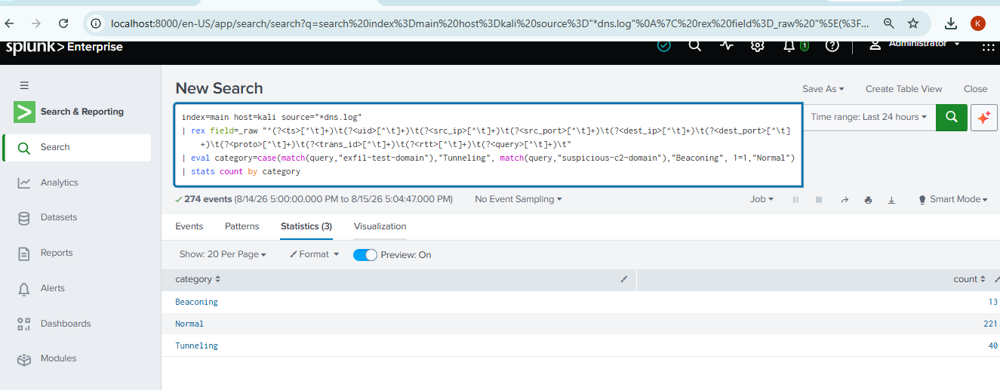
*274 total DNS events, split into 221 Normal, 40 Tunneling, and 13
Beaconing.*

**What I saw:** Out of 274 total DNS events I captured, the search
correctly separated them: 221 normal, 40 matching the tunneling pattern, 13
matching the beaconing pattern.

**Why it matters:** In a real environment, you're never handed
"suspicious traffic" pre-filtered — you have to pull it out of everything
else yourself. Being able to quantify how much of your traffic is normal
versus suspicious is usually the first step in triaging what's actually
going on.

I also ran a follow-up search to check exactly where the tunneling traffic
came from and when:

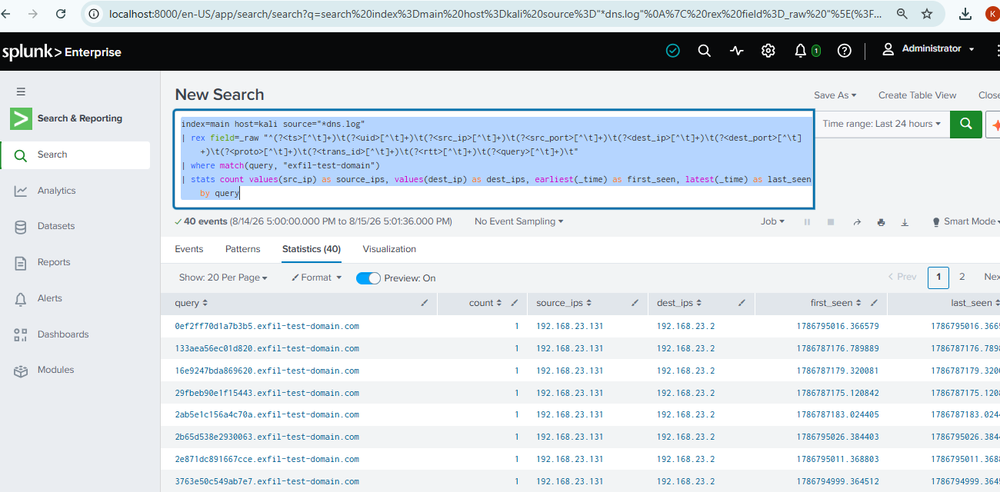
*All 40 tunneling-pattern queries traced back to a single source host
(`192.168.23.131`), within a tightly bounded time window.*

**What I'd do next:** Since every tunneling-pattern query came from one
host, in a tight time window, that's a strong, specific finding — not a
vague "something might be wrong somewhere." That specificity is exactly
what makes a finding actionable for escalation.

**MITRE ATT&CK data source:** Both techniques above rely on the same
underlying visibility — [DS0035 — DNS](https://attack.mitre.org/datasources/DS0035/),
specifically DNS query logs. This is the exact data source ATT&CK lists as
required to detect both T1048.003 and T1071.004, which is what Zeek's
`dns.log` provided here.

---

## The Dashboard

I brought all three findings together into one Splunk dashboard, **DNS
Threat Hunting Dashboard**, with three panels:

1. Suspicious Long/Random Subdomains (Tunneling Indicators) — a statistics table
2. C2 Beaconing Pattern Detection (Regular Interval NXDOMAIN Queries) — a table showing the calculated time gaps
3. Baseline DNS Query Volume (Normal Traffic) — a time chart, so the suspicious findings have visual "normal" traffic to stand out against

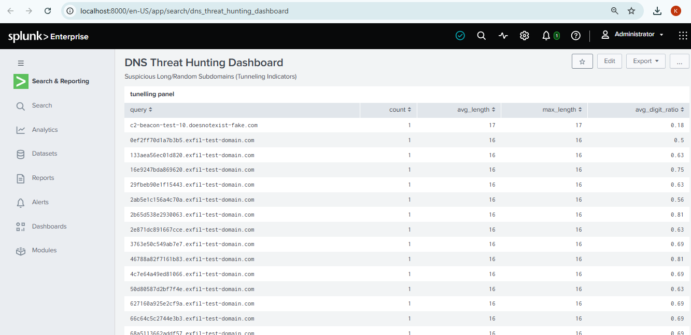
*The tunneling panel, showing every flagged subdomain with its length and
digit ratio.*

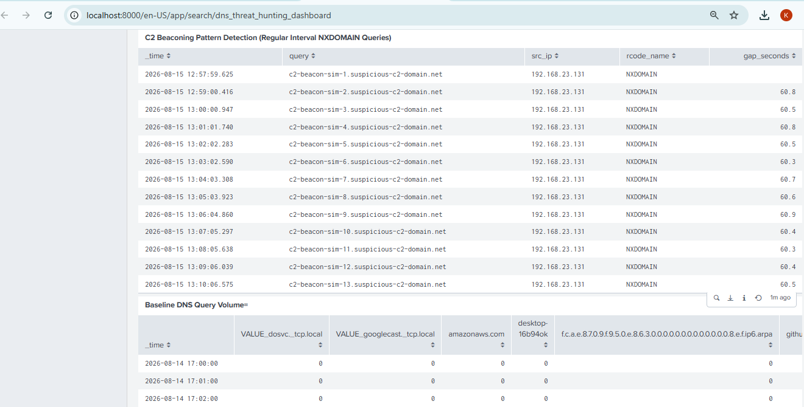
*The beaconing panel (top), showing the ~60-second gaps between each
suspicious query, and the baseline query volume panel (bottom) for
comparison against normal traffic.*

---

## Skills I Practiced in This Project

- Capturing and forwarding live network traffic through a real pipeline (Zeek, Splunk Universal Forwarder)
- Writing Splunk SPL: `rex`, `eval`, `stats`, `streamstats`, `timechart`, `case()`
- Manually extracting fields with regex when a vendor add-on's parsing failed
- Understanding and detecting two real DNS-based attack techniques: tunneling and C2 beaconing
- Building a SOC-style dashboard for reporting findings visually
- Writing up an investigation the way an analyst actually documents one: observation → why it matters → next action

---

## What's Next

I'm reusing this same pipeline and approach for my next project: **SSH
Brute-Force Detection** — running a real brute-force attempt from Kali
against a lab target, and building Splunk detections against `ssh.log`.

---

## Repository Structure

```
dns-threat-hunting-zeek-splunk/
├── README.md
├── screenshots/              # every investigation screenshot, in order
├── splunk_searches/          # raw .spl query files, ready to run
└── DNS_Threat_Hunting_Report.pdf   # polished standalone report
```
